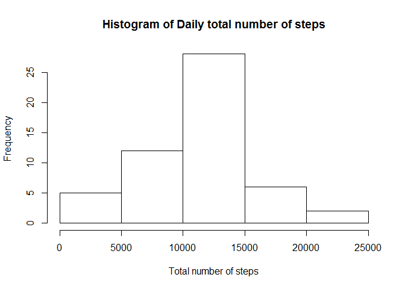
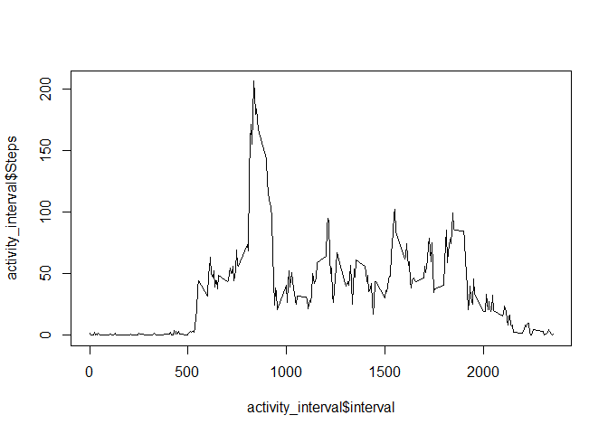
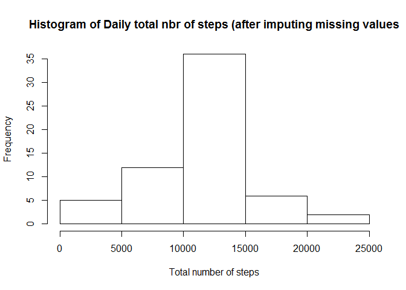
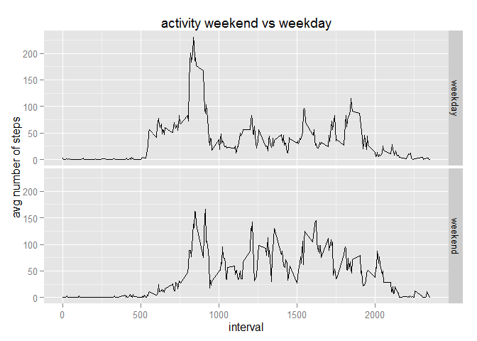

# Reproducible Research: Peer Assessment 1
Eric Hogewoning  


## Loading and preprocessing the data

```r
library(dplyr)
library(ggplot2)
##load the data, assumed to be in the working directory.
df_activity <- read.csv("activity.csv", stringsAsFactors=FALSE)
```


## What is mean total number of steps taken per day?


```r
## Calculate the total number of steps taken per day
activity_day <- summarize(group_by(df_activity, date), Steps = sum(steps))

## histogram of total steps per day
hist(activity_day$Steps, xlab="Total number of steps", main="Histogram of Daily total number of steps")
```

 

```r
## mean total number of steps per day
mean(activity_day$Steps, na.rm=TRUE)
```

```
## [1] 10766.19
```

```r
## medium total number of steps per day
median(activity_day$Steps, na.rm=TRUE)
```

```
## [1] 10765
```


## What is the average daily activity pattern?


```r
## summary and plot data by interval
activity_interval <- summarize(group_by(df_activity, interval), Steps = mean(steps, na.rm=TRUE))
plot(activity_interval$Steps~activity_interval$interval, type='l')
```

 

The 5-minute interval with the highest number of steps is:

```r
##calculate the maximum nbr of steps in the entire data set and select the row equal to that value.
activity_interval[activity_interval$Steps==max(activity_interval$Steps),]
```

```
## Source: local data frame [1 x 2]
## 
##   interval    Steps
## 1      835 206.1698
```


## Imputing missing values

Calculate number of incomplete rows:

```r
##calculate the number of rows with missing values
sum(!complete.cases(df_activity))
```

```
## [1] 2304
```

Missing values are filled by taking the average number of steps for that particular interval.


```r
##replace missing values with average value for that 5 minute interval

## copy dataframe to new dataframe which we will clean
df_cleaned <- df_activity

## replace NA's with average value from the dataframe which contains the mean activity per interval.
for (i in 1: nrow(df_cleaned)) {
 
    if(is.na(df_cleaned[i,1]) == TRUE)
    {        
        df_cleaned[i,1] <- activity_interval[activity_interval$interval==df_cleaned[i,3],2]         
    }      
}
```


After imputing the missing values, the total number of steps per day increases as shown in the following histogram.

```r
##create and show new histogram for cleaned data.
cleaned_day <- summarize(group_by(df_cleaned, date), Steps = sum(steps))
hist(cleaned_day$Steps, xlab="Total number of steps", main="Histogram of Daily total nbr of steps (after imputing missing values")
```

 

The mean and medium for the daily number of steps remain mostly unchanged (which is to be expected, since we replace the NA's with the mean values.)

```r
## calculate mean and median
mean(cleaned_day$Steps, na.rm=TRUE)
```

```
## [1] 10766.19
```

```r
median(cleaned_day$Steps, na.rm=TRUE)
```

```
## [1] 10766.19
```

## Are there differences in activity patterns between weekdays and weekends?

As we can see in the plot below, the activity patterns differ between weekdays and weekends. Activity starts earlier on weekdays, but overall activity seems higher during weekends.


```r
## create a function to determine whether a day number of the week is a weekday or weekend day.
f_weekend <- function(x)
{
    if(x == 0 || x==6) {'weekend'} else {'weekday'}    
}

## apply the above function to all days in the data frame.
df_cleaned$weekend <- sapply(as.POSIXlt(df_cleaned$date)$wday, FUN=f_weekend)
## convert to factor.
df_cleaned$weekend <- as.factor(df_cleaned$weekend)
## calculate mean number of steps per interval per weekend/weekday.
df_weekday_interval <- summarize(group_by(df_cleaned, interval, weekend), Steps = mean(steps))

## plot activity of weekends vs weekdays in 2 panels.
g <- ggplot(df_weekday_interval, aes(interval, Steps))
p <- g + geom_line() + labs(y="avg number of steps", x="interval", title="activity weekend vs weekday") + facet_grid(weekend ~ .) 
print(p)
```

 
